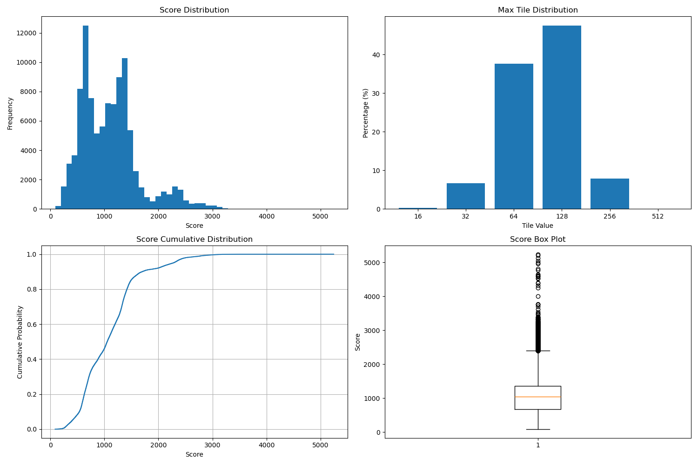
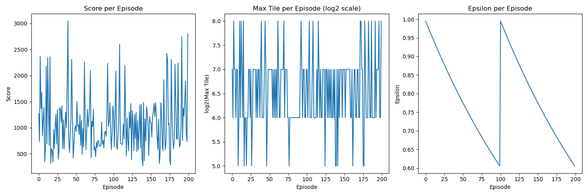
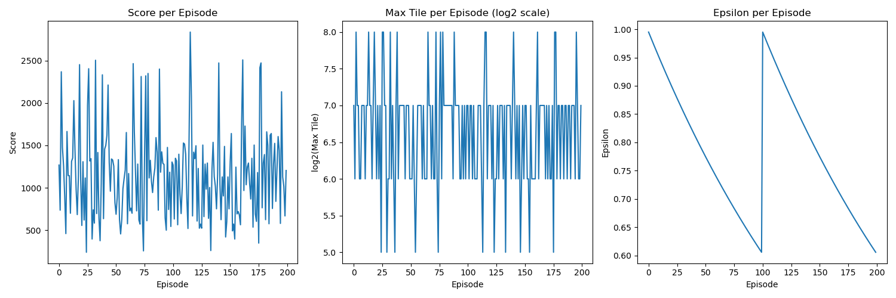
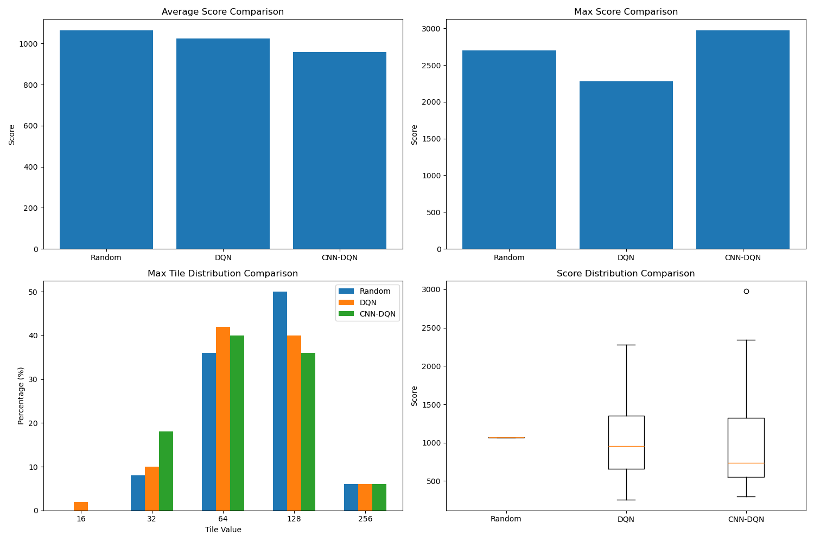

# 2048 强化学习智能体

本项目实现了多种智能体来玩2048游戏，包括基于强化学习的智能体和随机策略智能体。

## 项目结构

```
RL-2048/
├── data/                  # 数据目录
│   └── records/           # 游戏记录文件
├── logs/                  # 日志文件
├── models/                # 训练好的模型
├── src/                   # 源代码
│   ├── agents/            # 智能体实现
│   │   ├── cnn_rl_agent.py    # CNN-DQN智能体
│   │   ├── random_agent.py    # 随机策略智能体
│   │   └── rl_agent.py        # 基础DQN智能体
│   ├── core/              # 核心游戏逻辑
│   │   ├── game.py            # 2048游戏实现
│   │   ├── gui_interface.py   # 图形界面
│   │   ├── main.py            # 游戏主入口
│   │   └── text_interface.py  # 文本界面
│   ├── utils/             # 工具函数
│   │   ├── compare_agents.py  # 比较不同智能体
│   │   ├── ensure_record_dir.py # 确保记录目录存在
│   │   ├── recorder.py        # 游戏记录器
│   │   └── replay.py          # 游戏回放
│   └── visualization/     # 可视化
│       └── display.py         # 显示界面
├── main.py                # 主入口点
├── run_agent.py           # 运行智能体脚本
├── run_rl_agent.py        # 运行RL智能体脚本
├── requirements.txt       # 依赖项
└── setup.py               # 安装脚本
```

## 安装依赖

安装所需的依赖项：

```bash
pip install -r requirements.txt
```

或者安装为可开发模式的包：

```bash
pip install -e .
```

## 使用方法

### 主命令行界面

使用主命令行界面运行游戏、训练或评估智能体：

```bash
# 玩游戏
python main.py play --interface gui

# 训练智能体
python main.py train --agent dqn --episodes 1000

# 评估智能体
python main.py evaluate --agent cnn --games 100

# 比较不同智能体
python main.py compare --games 100
```

### 智能体运行器

使用智能体运行脚本直接运行特定智能体：

```bash
# 训练CNN智能体2000回合
python run_agent.py --agent cnn --train --episodes 2000

# 使用训练好的DQN智能体玩一局游戏
python run_agent.py --agent dqn --play
```

## 智能体类型

本项目包含三种不同的智能体：

### 1. DQN 智能体（全连接神经网络）

使用全连接神经网络的基础DQN智能体。

### 2. CNN-DQN 智能体（卷积神经网络）

使用卷积神经网络进行特征提取的高级智能体。

### 3. 随机策略智能体

随机选择有效动作的基准智能体，用于评估随机策略的性能上限。

## 工作原理

### DQN 智能体

基础DQN智能体使用：
- **状态表示**：一维热编码的4x4网格
- **动作空间**：四个可能的动作（上、右、下、左）
- **奖励函数**：每次移动后的分数增加
- **神经网络**：具有三个隐藏层的全连接神经网络
- **经验回放**：存储和采样过去的经验
- **目标网络**：用于稳定Q值目标的单独网络

### CNN-DQN 智能体

基于CNN的智能体对基础DQN进行了改进：
- **状态表示**：16通道4x4网格（每个2的幂一个通道）
- **卷积层**：从网格中提取空间特征
- **增强的奖励函数**：同时奖励分数增加和达到新的最大方块
- **更好的探索**：更有效地探索状态空间

### 随机策略智能体

随机策略智能体：
- **动作选择**：在每一步随机选择一个有效动作
- **基准性能**：用于评估其他智能体相对于随机策略的性能提升
- **性能上限**：揭示随机策略在2048游戏中能达到的最大方块和分数

## 实验结果

### 随机策略智能体性能

我们对随机策略智能体进行了大规模评估（100,000局游戏），得到以下结果：

```
随机策略评估结果 (100000 局游戏):
平均分数: 1095.78
最高分数: 5244
分数标准差: 535.84
分数中位数: 1052.00

最大方块分布:
方块 16: 283 次 (0.2830%)
方块 32: 6715 次 (6.7150%)
方块 64: 37598 次 (37.5980%)
方块 128: 47530 次 (47.5300%)
方块 256: 7855 次 (7.8550%)
方块 512: 19 次 (0.0190%)
```

这些结果表明：
- 随机策略的平均分数约为1096分
- 最高能达到5244分（极少数情况）
- 大多数游戏（约47.5%）最大方块为128
- 只有极少数游戏（0.019%）能达到512方块
- 没有游戏能达到1024或2048方块



*图1: 随机智能体在100,000局游戏中的表现统计*

### 强化学习智能体训练进度

#### 基础DQN智能体

基础DQN智能体在训练过程中的表现如下：



*图2: 基础DQN智能体训练100回合的进度*

从图中可以看出：
- 随着训练的进行，智能体的平均分数逐渐提高
- 最大方块值也随着训练逐渐增加
- 探索率（Epsilon）按照预设策略逐渐降低，使智能体从探索转向利用

#### CNN-DQN智能体

CNN-DQN智能体在训练过程中的表现如下：



*图3: CNN-DQN智能体训练100回合的进度*

从图中可以看出：
- CNN-DQN智能体的学习速度比基础DQN更快
- 在相同训练回合数下，CNN-DQN能达到更高的分数和更大的方块
- 卷积网络结构能更好地捕捉2048游戏中的空间特征

### 智能体性能比较

我们对三种智能体进行了性能比较：



*图4: 三种智能体性能比较*

比较结果显示：
- CNN-DQN智能体在平均分数和最高分数上都优于基础DQN和随机策略
- 强化学习智能体能够达到更大的方块值（如512、1024甚至2048）
- CNN-DQN智能体在分数分布上更加稳定，表现更加一致

## 训练进度

在训练过程中，会跟踪并可视化智能体的进度：
- 每回合的分数
- 每回合达到的最大方块
- 探索率（epsilon）的变化

训练进度图表会保存为PNG文件。

## 模型保存/加载

训练好的模型会保存到：
- 基础DQN智能体：`models/rl_model.pth`
- CNN-DQN智能体：`models/cnn_rl_model.pth`

您可以使用 `--model` 参数指定不同的路径。

## 结论

通过本项目的实验，我们得出以下结论：

1. 随机策略在2048游戏中的表现有限，很难达到512以上的方块
2. 强化学习方法能显著提升智能体的性能，特别是使用CNN结构的智能体
3. CNN-DQN智能体能够学习到更复杂的策略，达到更高的分数和更大的方块值
4. 适当的奖励函数设计和网络结构对强化学习智能体的性能至关重要

这些结果表明，强化学习是解决2048游戏这类组合优化问题的有效方法，而CNN结构能够更好地捕捉游戏中的空间特征，从而提升性能。 